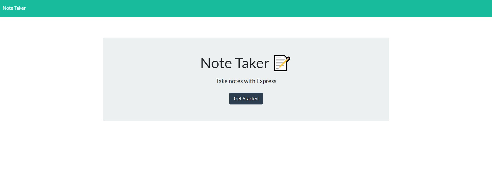
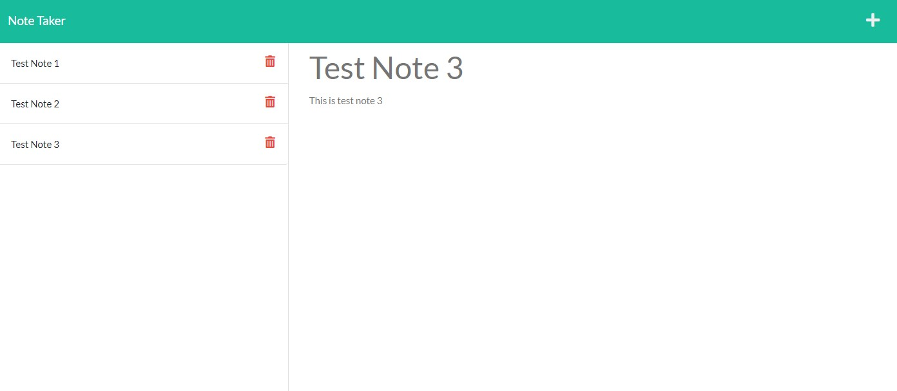

# Express Note Taker

  ## License
  

  ## Description
  An application that uses an Express.js back end and will save and retrieve note data from a JSON file

  ### Screenshot
  

  

  ### Walkthrough Video

  

  ## Table of Contents
  * [Installation](#installation)
  * [Usage](#usage)
  * [Contributing](#contributing)
  * [Questions](#questions)
        
  ## Installation
   - Clone this repository to use the application on your local machine.
   - Enter `npm install` in the terminal to install the necessary dependencies.
   
  ## Usage
  - Enter `node server.js` in the terminal to run application on localhost server PORT 3001.
  - Open browser and type `http://localhost:3001/` into the address bar to use application.

  ## Contributing
  Charity Rogers

  ## Questions
  If you have any questions, please contact me!

  - GitHub: https://github.com/rogerscl116
  - Email: rogerscl116@gmail.com 
